<!--
═══════════════════════════════════════════════════════════════
  PERSONNALISATION RAPIDE  (Ctrl+H -> Remplacer dans tout le fichier)
───────────────────────────────────────────────────────────────
  Oliium                 ->  ton pseudo GitHub
  Ton Nom                ->  ton nom / prénom affiché
  RANG_ACTUEL            ->  ton rang RL (voir l'échelle plus bas)
  ton.email@exemple.com  ->  ton email
  ton-linkedin           ->  l'identifiant de ton profil LinkedIn
  ton-handle             ->  ton @ Twitter / X / Discord
  Les badges "Loadout" : remplace/ajoute les technos de ton stack
═══════════════════════════════════════════════════════════════
-->

<!-- ░░░ BANNIÈRE CUSTOM (banner.svg dans ce repo) ░░░ -->

 

<!-- ░░░ TEXTE ANIMÉ ░░░ -->

 

<!-- ░░░ BADGES DE LIAISON ░░░ -->

 

## 🏁 Kickoff

> **Salut, moi c'est Ton Nom** — développeur **full-stack** qui traite chaque projet comme un kickoff : aérien propre, touche première balle, et on shoot direct dans la lucarne. 🥅

- 🔭 &nbsp;Je bosse actuellement sur **`ton projet en cours`**
- 🌱 &nbsp;J'apprends en ce moment **`une techno que tu explores`**
- 🤝 &nbsp;Ouvert à collaborer sur **`type de projets / open-source`**
- ⚽ &nbsp;Quand je ne code pas : **rotations, demos et ceiling shots**
- ⚡ &nbsp;Fun fact : **`ton fun fact ici`**

 

---

## 🏆 Rang — Saison GitHub

<!-- ░░░ RANG ACTUEL (change RANG_ACTUEL + la couleur) ░░░ -->

  

<!-- ░░░ ÉCHELLE DES RANGS (le tien = mets-le en avant) ░░░ -->

| Tier | Rang Rocket League | Équivalent dev |
|:---:|:---|:---|
| 🥉 | **Bronze** | Premiers commits, on apprend les rotations |
| 🥈 | **Silver** | Les bases tiennent, le boost se gère |
| 🥇 | **Gold** | Solide en 1v1, premiers projets livrés |
| 🔷 | **Platinum** | Lecture de jeu, full-stack assumé |
| 💎 | **Diamond** | Aériens fiables, archi propre |
| 🏆 | **Champion** | Mécaniques avancées, mentor d'équipe |
| 👑 | **Grand Champion** | Game sense d'élite, perf en prod |
| 🌟 | **Supersonic Legend** | Le pinacle. Freestyle en pull-request. |

<!-- Barre de progression visuelle -->

`Bronze` ▰▰▰▰▰▰▰▱▱▱ `SSL` &nbsp;&nbsp;**70% — en route vers le prochain palier**

 

---

## 🔧 Loadout — Mon stack technique

> *Comme un setup de voiture : châssis, moteur, boost et décalcomanies.*

### 🏎️ &nbsp;Châssis — Frontend

### 🔩 &nbsp;Moteur — Backend

### 🛢️ &nbsp;Réservoir — Bases de données

### ⛽ &nbsp;Boost — DevOps & Outils

### 🎨 &nbsp;Décals — Design & Co.

 

---

## 📊 Stats de match

 

  

<!-- ░░░ TROPHÉES ░░░ -->

  

<!-- ░░░ COURBE D'ACTIVITÉ (le replay du match) ░░░ -->

 

---

### 🚀 *« What a save! »* — merci d'être passé sur mon arène.

