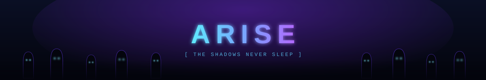

<!--
═══════════════════════════════════════════════════════════════════
  PERSONNALISATION  (Ctrl+H -> Remplacer dans tout le fichier)
───────────────────────────────────────────────────────────────────
  Oliium                 ->  ton pseudo GitHub
  Ton Nom                ->  ton nom / prénom affiché
  ton-entreprise         ->  ta guilde / boîte / "Freelance"
  ton.email@exemple.com  ->  ton email
  ton-linkedin           ->  identifiant LinkedIn
  ton-handle             ->  ton @ sur X / Twitter
  ton-discord            ->  ton identifiant Discord
  ton-prochain-skill     ->  la techno que tu apprends
  PROJET_1 / 2 / 3       ->  tes vrais projets (les "Gates")
  Arsenal / Stats        ->  remplace par tes vraies technos
───────────────────────────────────────────────────────────────────
  Assets faits main :  banner.svg · divider.svg · footer.svg
  Snake animé : voir .github/workflows/snake.yml (active les Actions)
═══════════════════════════════════════════════════════════════════
-->

<details open>
<summary><code>◤ SYSTEM ◢ — A PLAYER HAS AWAKENED. INITIALIZING NODE...</code></summary>

<div align="center">


<br/>


```text
╔══════════════════════ THE SYSTEM // PLAYER STATUS ═══════════════════════╗
║  PLAYER  ▸  Ton Nom  (@Oliium)                                           ║
║  JOB     ▸  Shadow Monarch  //  Full-Stack Developer                     ║
║  TITLE   ▸  "Celui qui livre en prod"                                    ║
║ ──────────────────────────────────────────────────────────────────────── ║
║  HP    ██████████████████░░  92%                                         ║
║  MANA  ███████████████░░░░░  78%                                         ║
║  EXP   █████████████░░░░░░░  64%   ▸  NEXT AWAKENING                     ║
║ ──────────────────────────────────────────────────────────────────────── ║
║  STATUS  ▸  ONLINE / BUILDING       GATE ▸  CLEARING DAILY               ║
╚══════════════════════════════════════════════════════════════════════════╝
```


<br/>


<br/>


</div>

</details>

<p align="center"></p>

## `⟦ SYSTEM MESSAGE ⟧ // PROFILE`


> _"Même le plus faible des chasseurs peut devenir le plus fort — tant qu'il ne cesse jamais de level up."_

Je suis **développeur full-stack** et je traite chaque projet comme un **Gate** à clear : repérer le boss, choisir le bon loadout, et ressortir vivant avec du code propre.

- 🗝️ &nbsp;Je clear actuellement le donjon : **`ton projet en cours`**
- 🔮 &nbsp;Nouveau sort en cours d'apprentissage : **`ton-prochain-skill`**
- 🤝 &nbsp;Je recrute une *party* pour les raids : **`open-source / side-projects`**
- 🩸 &nbsp;Fun fact : **`ton fun fact ici`**

```text
┌───────────────────── DAILY QUEST // BECOME STRONGER ─────────────────────┐
│  [x]  Clear today's gate         (daily commit)                          │
│  [x]  Write 100 lines of clean code                                      │
│  [ ]  Defeat a legacy boss       (refactor in progress)                  │
│  [ ]  Unlock new skill : ton-prochain-skill                              │
│  !!   Penalty applies if the quest is abandoned.                         │
└──────────────────────────────────────────────────────────────────────────┘
```

<p align="center"></p>

## `⟦ SKILL TREE ⟧ // ARSENAL`

<div align="center">

### `[ PRIMARY WEAPONS — LANGUAGES ]`


### `[ ARMOR — FRONTEND ]`


### `[ ENGINE — BACKEND ]`


### `[ VAULT — DATA ]`


### `[ RUNES — OPS & TOOLING ]`


</div>

<p align="center"></p>

## `⟦ GATES CLEARED ⟧ // PROJECTS`

<table>
<tr>
<td width="50%" valign="top">

**`▸ GATE : PROJET_1`**
```
RANK    :: S-Rank Gate
BOSS    :: Scalabilité
STACK   :: Next · Node · PostgreSQL
STATUS  :: CLEARED
```

</td>
<td width="50%" valign="top">

**`▸ GATE : PROJET_2`**
```
RANK    :: A-Rank Gate
BOSS    :: Temps réel
STACK   :: React · WebSocket · Redis
STATUS  :: CLEARED
```

</td>
</tr>
<tr>
<td width="50%" valign="top">

**`▸ GATE : PROJET_3`**
```
RANK    :: B-Rank Gate
BOSS    :: Dette technique
STACK   :: TypeScript · Docker
STATUS  :: IN PROGRESS
```
_Refactor en cours — le boss résiste encore._

</td>
<td width="50%" valign="top">

**`▸ GATE : ??? `**
```
RANK    :: CLASSIFIED
BOSS    :: UNKNOWN
STACK   :: CLASSIFIED
STATUS  :: DOUBLE DUNGEON — INCOMING
```
_Un nouveau Gate s'ouvre bientôt..._

</td>
</tr>
</table>

<p align="center"></p>

## `⟦ STATUS WINDOW ⟧ // TELEMETRY`

<div align="center">


<br/>


<br/>


<br/>


<br/>

<picture>
  <source media="(prefers-color-scheme: dark)" srcset="https://raw.githubusercontent.com/Oliium/Oliium/output/github-snake-dark.svg" />
  
</picture>

</div>

<p align="center"></p>

## `⟦ SHADOW NETWORK ⟧ // CONNECT`

<div align="center">

<a href="https://github.com/Oliium">
  
</a>
&nbsp;
<a href="https://www.linkedin.com/in/ton-linkedin/">
  
</a>
&nbsp;
<a href="https://x.com/ton-handle">
  
</a>
&nbsp;
<a href="mailto:ton.email@exemple.com">
  
</a>
&nbsp;
<a href="https://discord.com/users/ton-discord">
  
</a>

</div>

<p align="center"></p>

<div align="center">

```text
╔══════════════════════ SYSTEM // SESSION TERMINATED ══════════════════════╗
║  > Shadow exchange complete.                                             ║
║  > Returning to the Monarch's domain...                                  ║
║  > See you in the next Gate.       ARISE.                                ║
╚══════════════════════════════════════════════════════════════════════════╝
```



<br/>

<sub><code>[ SYSTEM: ONLINE ]</code> &nbsp;·&nbsp; <code>[ PLAYER: OLIIUM ]</code> &nbsp;·&nbsp; <code>[ SHADOWS: READY ]</code></sub>

</div>
